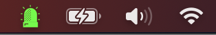

# MacMenuStatus

[](https://github.com/batuhan0sanli/MacMenuStatus/releases)
[](https://github.com/batuhan0sanli/MacMenuStatus/blob/main/LICENSE.md)

---



MacMenuStatus is a simple menu bar app for macOS that shows widgets status in the menu bar.

Green means everything is working, red means something is wrong. It's very simple!

[](https://github.com/batuhan0sanli/MacMenuStatus/releases/download/v0.0.1/MacMenuStatus.app.zip)

## Features

* Simple
* Easy to use
* Easy to add widgets
* (soon) Add filters to widgets to only show when they are needed
* (soon) Notifications / Alerts when widgets status changes

## Widgets

**Ping:** Ping is a simple widget that pings a host. Useful for checking if your internet is working or if a server is
up.

**DNS:** DNS is a simple widget that checks set DNS servers. Useful for checking if your DNS servers are set correctly.

## Requirements

* Python 3.11
* [Rumps](https://pypi.org/project/rumps/)
* [PyYAML](https://pypi.org/project/PyYAML/)
* [Py2App](https://pypi.org/project/py2app/)  (only for building)

## Installation

### From source

```bash
git clone https://github.com/batuhan0sanli/MacMenuStatus
cd MacMenuStatus
pip install -r requirements.txt
python3 main.py
```

### From source (with pipenv)

```bash
git clone https://github.com/batuhan0sanli/MacMenuStatus
cd MacMenuStatus
pipenv install
pipenv run start
```

## Build

```bash
python3 setup.py py2app
```

```bash
pipenv run build
```

## License

[GPL-3.0 License](LICENSE.md)

## Contributing

Pull requests are welcome. If you want to add a widget, please create a new file in `widgets` folder and add it
to `widgets/__init__.py`.
